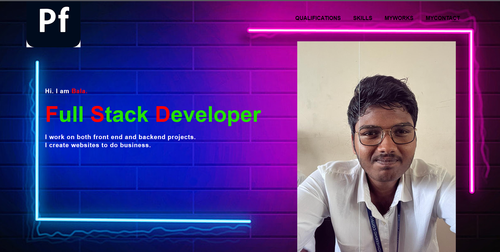

# Experiment 8
# portfolio-html-css
# Aim
To create a portfolio using html and css
# Algorithm
1. Open visual studio code
2. Create a html and css file
3. Link the css file to html using <link tag
4. Store the images for your portfolio in a directory and then using 
<html>
<head>
    <title>My Portfolio</title>
    <link rel="stylesheet" href="style.css">
</head>
<body>
    <div class="main">
        <div class="navbar">
            
            <ul>
                <li><a href="qualify.html">QUALIFICATIONS</a></li>
                <li><a href="skills.html">SKILLS</a></li>
                <li><a href="#">MYWORKS</a></li>
                <li><a href="contact.html"> MYCONTACT</a></li>
            </ul>
        </div>
        <div class="info">
            <h3>Hi. I am <span>Bala.</span></h3>
            <br>
            <h1><span>F</span>ull <span>S</span>tack <span>D</span>eveloper</h1>
            <br>
            <h3>I work on both front end and backend projects.<br> 
                I create websites to do business.
            </h3>
        </div>
    </div>
    <div class="image">
        
    </div>
</body>
</html>

```
# style.css
```
*{
    margin: 0%;
    padding: 0%;
}
.main{
        width: 100%;
        height: 100vh;
        font-family: sans-serif;
        background: url(/Images/rd.jpg);
        background-position: center;
        background-size: cover;
        position: relative;
}
.navbar{
    width: 86%;
    display: flex;
    justify-content: space-between;
    margin: auto;
    padding: 15px 0;
    align-items: center;
}
.navbar .logo{
    width: 160px;
    cursor: pointer;
    margin-top: -3%;
    margin-left: -2%;
}
ul{
    margin-top: -4%;
}
ul li{
    list-style: none;
    display: inline-block;
    padding: 10px 16px;
}
ul li a{
    font-size: 16px;
    font-weight: bold;
    text-decoration: none;
    margin-top: -3%;
    color: black;
    transition: .4s ease;
}

ul li a:hover{
    color: white;
}
.info{
    margin-left: 9%;
    margin-top: 7%;
    color: white;
}
.info h1{
    font-size: 65px;
    color: rgb(34, 225, 5);
}
.info h3{
    font-size: 18px;
    letter-spacing: 1px;
    line-height: 24px;
}
.info span{
    color: rgb(255, 0, 0);
}
.image{
    width: 30%;
    height: 60%;
    position:absolute;
    right: 100px;
    bottom: 0;
}
.image img{
    position: absolute;
    height: 140%;
    left: 40%;
    transform: translate(-50%);
    bottom:0;
}
```
# Output


# Result 
Thus a a portfolio using html and css is created successfully.
